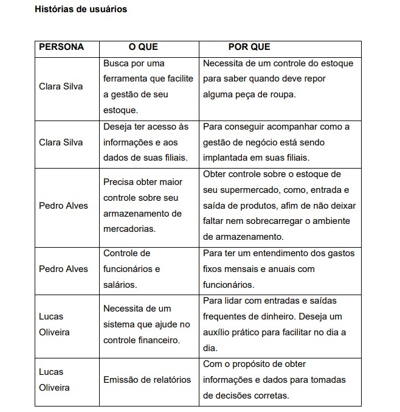

# Especificações do Projeto

 A definição exata do problema e os pontos mais relevantes a serem tratados neste 
projeto foi consolidada com a participação dos usuários em um trabalho de imersão 
feita pelos membros da equipe a partir da observação dos usuários em seu local 
natural e por meio de entrevistas. Os detalhes levantados nesse processo foram 
consolidados na forma de personas e histórias de usuários.

## Personas

O cliente ideal para AgilFornec engloba todos os microempreendedores e 
empreendedores de peque e média empresa, podendo também abranger para
empreendimentos grandes também. Segue exemplos de usuários fictícios que 
necessitam da utilização do sistema:

Clara Silva, 25 anos, empresária de uma loja de roupas. 
Motivação: busca por uma ferramenta que facilite a gestão de seu estoque, pedidos 
e clientes de forma mais ágil e eficiente.

Pedro Alves, 30 anos, dono de um supermercado.
Motivação: busca por uma plataforma que permita o gerenciamento de estoque, 
preços, pedidos e promoções de forma simplificada e integrada.

Lucas Oliveira, 22 anos, microempreendedor. 
Motivação: busca por uma plataforma que possibilite ter uma gestão financeira mais 
alinhada com o ideal para sua microempresa. Além disso, ele trabalha com muitos 
produtos diferentes e precisa ter um controle sob seu estoque.

## Histórias de Usuários

## Requisitos

O escopo funcional do projeto é definido por meio dos requisitos funcionais e não 
funcionais que são apresentados a seguir.

### Requisitos Funcionais

|       ID      |                Descrição              |   Prioridade  |
| ------------- | ------------------------------------- |-------------  |
|      RF-1     | Gerenciamento de cadastros.           |      Alta     |
|      RF-2     | Controle de estoque.                  |      Alta     |
|      RF-3     | Gerenciamento de dados e informações. |      Média    |
|      RF-4     | Controle de acesso.                   |      Alta     |
|      RF-5     | Emitir relatórios.                    |      Média    |
|      RF-6     | Controle de finanças.                 |      Média    |
|      RF-7     | Gerar pedido de compra.               |      Média    |
|      RF-8     | Upload de arquivos.                   |      Baixa    |
|      RF-9     | Controle de funcionários.             |      Média    |
|      RF-10    | Buscar e filtrar dados relevantes.    |      Baixa    |
|      RF-11    | Visualização de dashboards.           |      Baixa    |

### Requisitos não Funcionais

|       ID      |                Descrição              |   Prioridade  |
| ------------- | ------------------------------------- |-------------  |
|     RNF-1     | Responsividade.                       |      Alta     |
|     RNF-2     | Hospedagem para o sistema.            |      Alta     |
|     RNF-3     | Manutenibilidade, facilidade de mantero sistema e de atualizar.|      Alta     |
|     RNF-4     | Praticidade no fluxo de interação     |      Média    |
|     RNF-5     |  Escalabilidade, possibilidade de ampliação no conteúdo.|      Média    |

## Restrições

As questões que limitam a execução desse projeto e que se configuram como 
obrigações claras para o desenvolvimento do projeto em questão são apresentadas 
na tabela a seguir.

|       ID      |                Descrição              |
| ------------- | ------------------------------------- |
|      RE-1     | Limitação para escolha de linguagens de desenvolvimento backend.|
|      RE-2     | Data limite para entrega de etapas do projeto.                  |
|      RE-3     | Impossibilidade de contratação de serviços terceirizados.       |

## Diagrama de Casos de Uso

O diagrama contempla as principais ligações previstas entre casos de uso e atores 
e permite detalhar os Requisitos Funcionais identificados na etapa de licitação.

